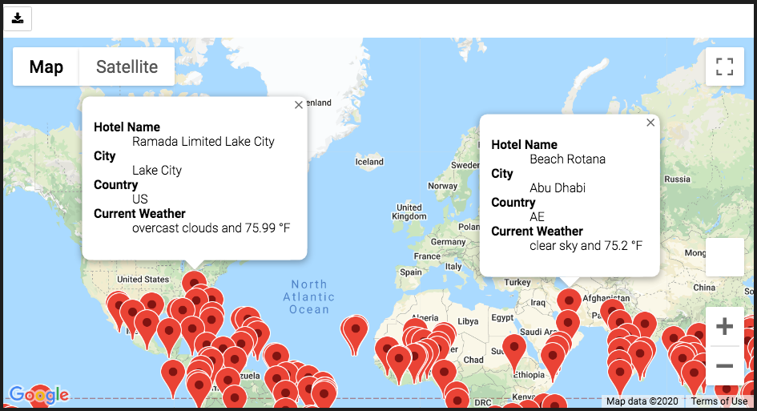
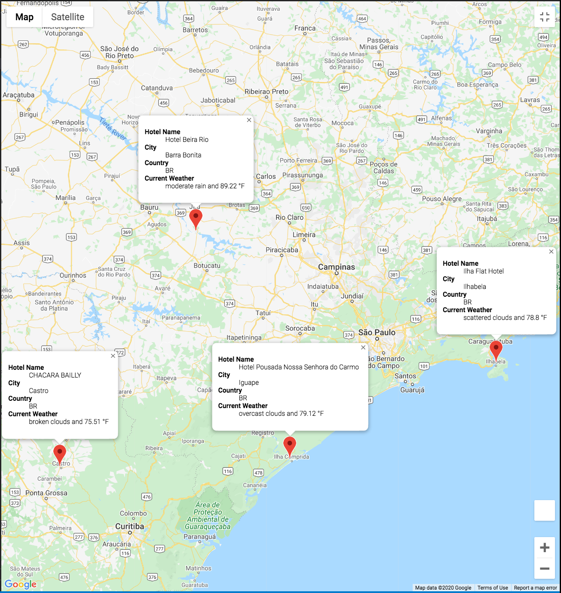
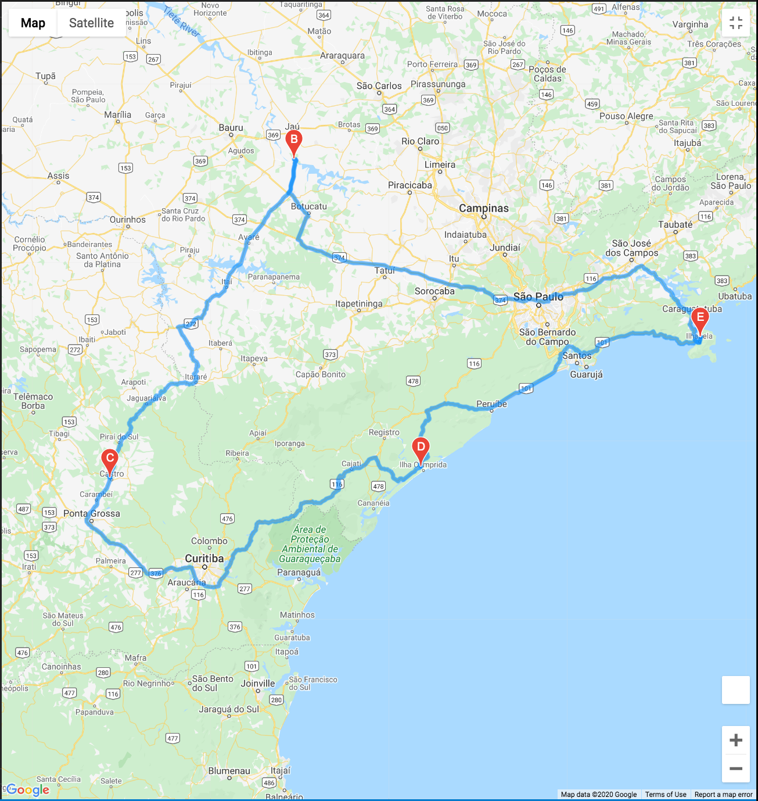

# **Trip Planning Based on Weather Condition**  

## **Overview of Project**
In this project we are trying to help the customers of a trip planning company to find their desired destinations.

### **Project Summary**

The project consists of three different sections:

1. In the first part of the analysis we generated a random number of latitude/longitude sets and determined the nearest cities to those coordinates. then using the OpenweatherMap API the weather information of the cities were retrieved.(The code for analysis: [Weather_Database.ipynb](Weather_Database/Weather_Database.ipynb)

    &nbsp;
2. in the second section we filtered the cities based on the customer's desired weather condition. Then using Google maps API we retrieved the name of the hotels in those areas and showed all potential travel destinations on the map along with a pop-up marker containing hotel name, city name, country name and current weather condition of the destination (see image below)(The code for analysis: [Vacation_Search.ipynb](Vacation_Search/Vacation_Search.ipynb)).

&nbsp;

3. in the last part of the project we made a travel itinerary by choosing four cities from potential destinations, close together, and using the Google maps directions API the route to travel between these four cities was created (see images below)(The code for analysis: [Vacation_Itinerary.ipynb](Vacation_Itinerary/Vacation_Itinerary.ipynb)).

&nbsp;